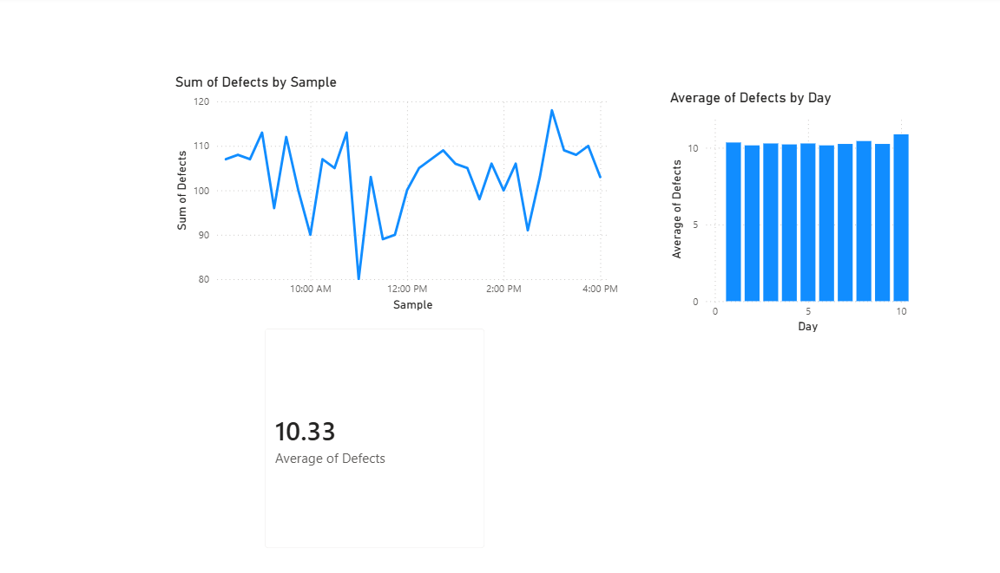

# defect-trend-analysis-powerbi
# Defect Trend & Process Stability Analysis

## Overview
This project analyzes defect data to evaluate process stability and identify patterns in defect occurrence over time.

## Objective
To monitor defect trends, assess process consistency, and recommend improvements to enhance product quality.

## Tools Used
- Power BI
- Excel
- Data Analysis

## Dashboard

## Key Insights
- The average defect level is 10.16 defects per sample
- Defects are consistent across days with no significant variation
- The line chart shows fluctuations over time, indicating process instability

## Recommendation
Focus on improving process consistency and reducing variability to enhance overall quality performance.

## Files Included
- Power BI file (.pbix)
- Dashboard screenshot
- Dataset (.csv)

